郭坤昌2012522

## 第一章问题

网络结构如下图所示，主机A与主机B之间通过两段链路和一台转发设备R进行连接，每条链路的长度和传输速率已经在图中标出，R采用存储转发机制。主机A向主机B发送一个长度为10000字节的报文，请回答以下问题（设电磁波传播速度为$2\times10^8$米/秒）

1. 如果采用报文交换，请计算端到端的最小时延，即从主机A传输报文的第一位开始，到主机B接收到报文的最后一位为止所用的时间。

2. 如果将报文分成5个报文分组传输，请计算完成报文传输的最小端到端时延（忽略报文分组的封装开销）。

3. 在统计多路复用机制中，端到端的时延具有不确定性，请简要分析影响端到端时延的主要因素。

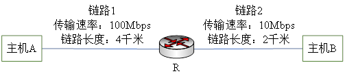

 答:

1. 采用报文转发方式，具有最小端到端时延的情况是只考虑传播时延和传输时延，而不考虑排队时延、处理时延等，解答如下

   

2. 将报文分为5个分组，忽略报文分组开销，解答如下
   

   
3. 使用统计多路复用时，影响端到端时延的因素为：

   统计多路复用的原理，是只为需要传输数据的终端分配资源。需要不断扫描终端，接收发送请求，将其要发送的资源收集到缓冲区中排队，在主机的一定调度策略下，利用存储有该用户地址信息的STDM帧进行传输。因此它是一种按需分配的策略。

   时延的类型分为传输时延、传播时延、处理时延和排队时延等，在统计多路复用策略下，下列是可能产生较大影响的因素：

   - 流量强度。当多个用户提起大量发送请求时，数据涌入缓冲区排队，流量强度越大，平均排队时延越长。此外，统计多路复用需要在时间间隙处存放终端的地址信息，一定程度上增大了流量强度。
   - 发送策略。路由器以特定协议为数据包选路，不同的传输路径具有不同的传播、发送时延等。此外，按何种顺序发送缓冲区中的数据也会影响排队时延。
   - 处理策略。路由器可能将数据切分为多个帧，并决定是否增加差错检测和恢复、数据压缩等，该部分处理的复杂程度影响处理时延。

## 第二章问题

1. 通过使用Windows命令行模式提供的nslookup命令查询www.baidu.com的IP地址，给出结果截图，并对返回的结果进行解释。同时，利用Wireshark捕获查询的交互过程，给出结果截图，并进行简要说明。

2. 以反复解析为例，说明域名解析的基本工作过程（可以结合图例）。给出内容分发网络（CDN）中DNS重定向的基本方法，说明原始资源记录应该如何修改，并描述重定向过程。

3. 在DNS域名系统中，域名解析时使用UDP协议提供的传输层服务（DNS服务器使用UDP的53端口），而UDP提供的是不可靠的传输层服务，请你解释DNS协议应如何保证可靠机制。

 答：

1. 

1. 1 执行nslookup命令查询www.baidu.com对应的IP地址，返回信息如下：

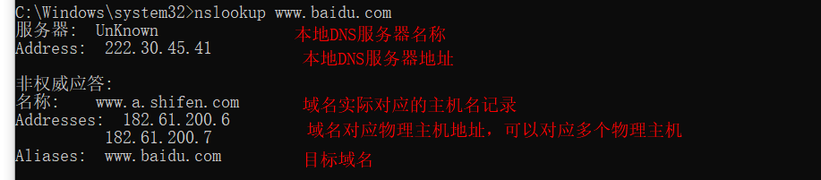

[^1]:nslookup返回信息说明

执行ipconfig命令，注意到220.30.45.41对应本地DNS服务器地址

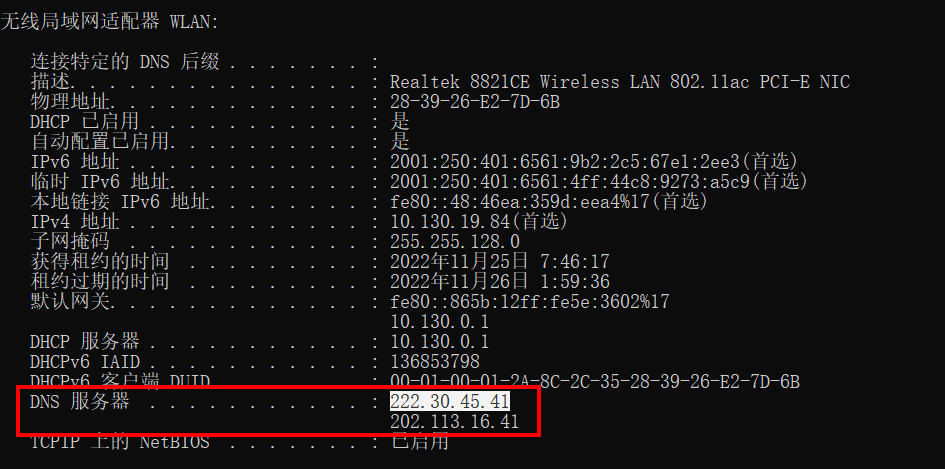

在nslookup返回结果中，提示非权威应答。说明返回DNS记录的服务器不是主机名www.baidu.com所对应的权威DNS服务器。因其之前接收过相同请求，将保存在缓存中的记录重新取出返回。

物理主机地址不唯一，通过配置多个对应该域名的物理主机，并配合响应算法，可以实现负载均衡。

1. 2 利用Wireshark捕获查询的交互过程

执行nslookup命令寻找主机名www.baidu.com的地址，通过wireshark捕获到三组DNS请求-响应，由本地主机向本地DNS服务器发送请求，并收到服务器响应。

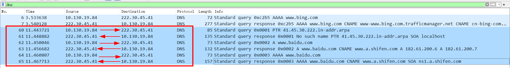

具体看每次交互过程。

第一次DNS请求，由主机使用UDP协议发往DNS服务器对应的53端口，标志位中的应答位为0，表示请求。问题字段记录了问题的数量为1个。在请求中，使用PTR请求查询DNS服务器对应IP地址所在的域名。因为在PTR记录中，IP地址被切分、倒序存储，因此这里的DNS服务器地址也是这样发起请求的。

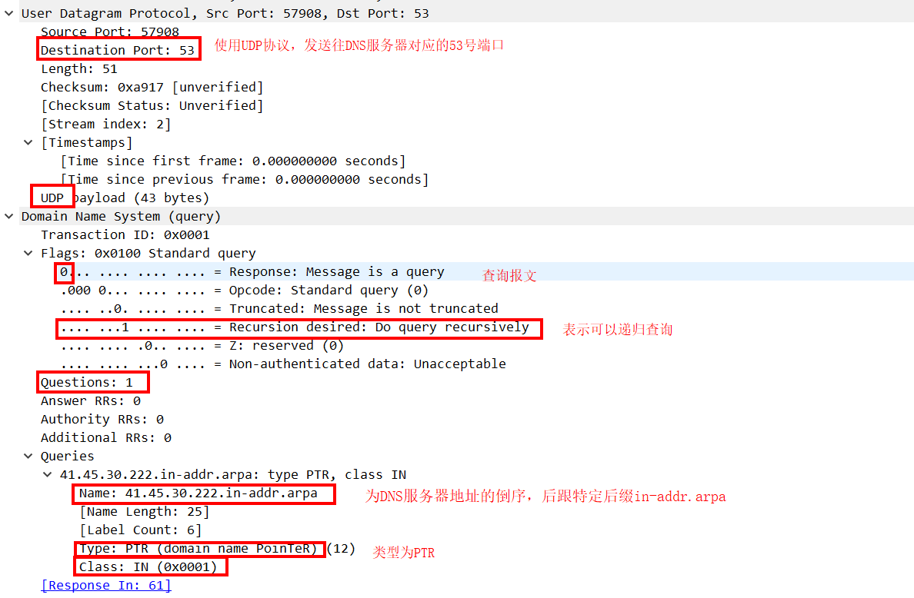

服务器向主机回应第一次DNS请求，为SOA记录，包含了被授权管理的服务器名、生存期、刷新时间等。

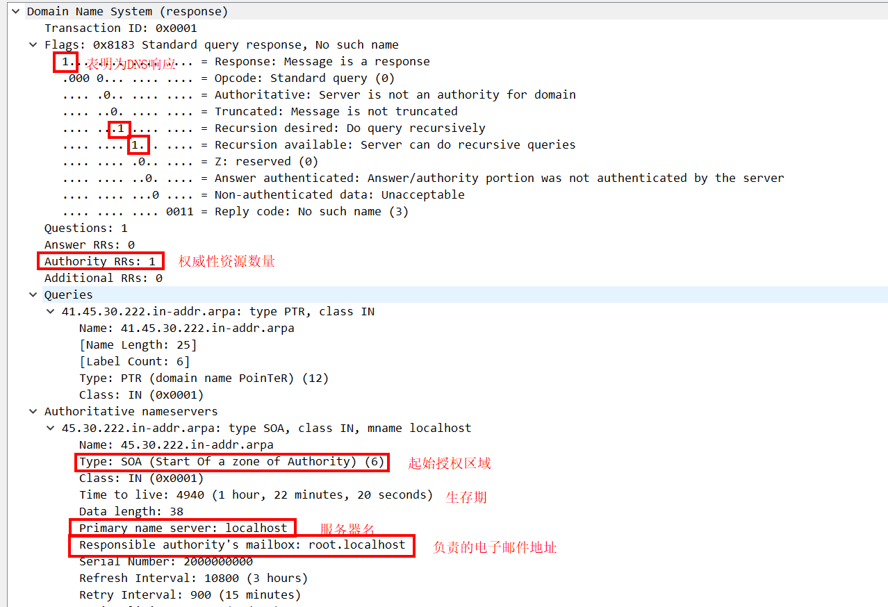

第二次DNS请求，表明递归查询www.baidu.com对应的IPV4地址（以类型A表示）

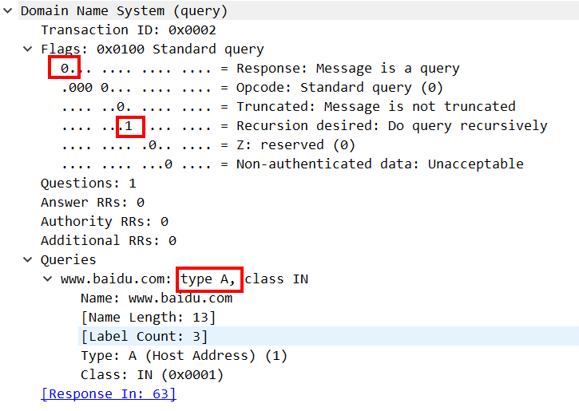

服务器返回第二次请求，这里CNAME类型表示该资源的值为规范主机名。另外在两个A类资源中，包含了该主机名对应的IP地址。

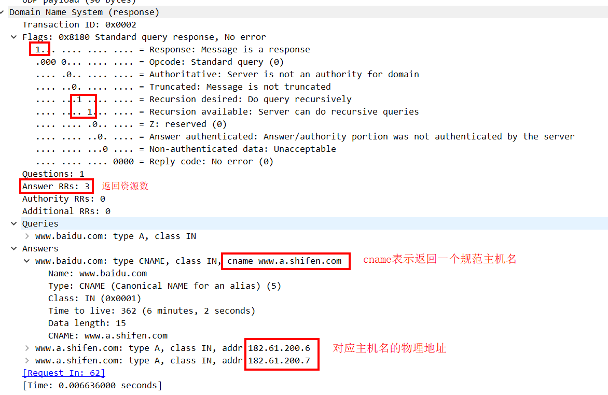

第三次DNS请求时AAAA类型，表示查询IPV6地址。对应响应如下，包含了主机名对应DNS服务器的权威域名服务器的信息，包括该服务器的名称、刷新间隔、最短生存期等。

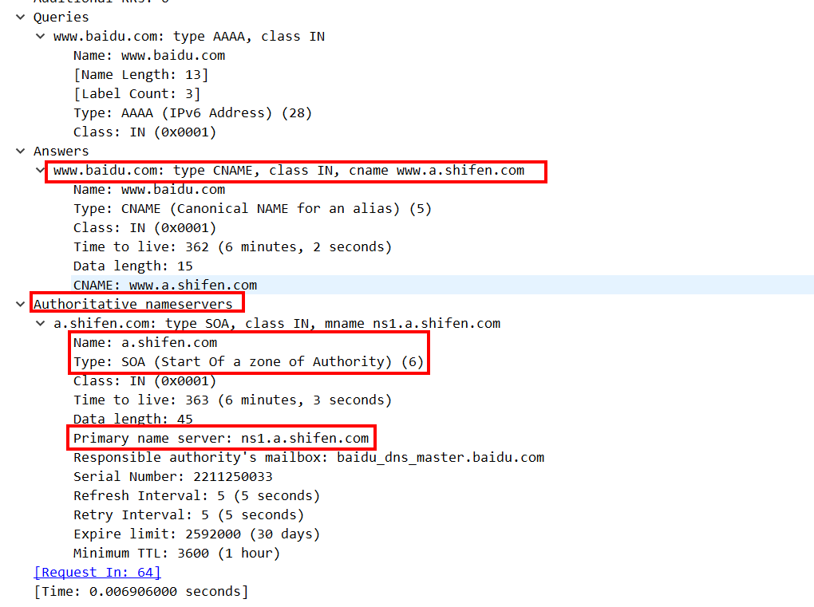

2. 

2. 1 反复解析即迭代解析，是以DNS客户端为中心，执行的DNS查询。对于要查询的域名，执行如下操作：

（1）DNS客户端向所配置的本地名称服务器发出解析域名的请求。

（2）本地名称服务器收到客户端请求，先查询本地缓存。若没有查到该域名对应记录，则本地服务器把所配置的根服务器地址信息通过DNS应答返还给客户端；否则直接响应对应记录。

（3）DNS客户端收到本地服务器的DNS应答，根据提供的根服务器地址，向其发送解析域名的DNS请求。

（4）根服务器收到DNS请求后，查询得到顶级域名所对应的顶级服务器地址，向客户端发送DNS响应。

（5）DNS客户端向顶级域名服务器发送解析请求，若顶级域名服务器没有对应缓存记录，则返回一个二级域名服务器地址。

（6）这样，DNS客户端不断根据返回的结果，进行查询请求，直到获得需要的DNS记录。否则若在权威域名服务器也无法找到，则解析失败。

（7）DNS客户端在收到`.com`顶级名称服务器的DNS应答报文，得到`microsoft.com`二级域名所对应的二级名称服务器地址后，再次向对应的二级名称服务器发送一条解析`example.microsoft.com`域名的DNS请求报文（图中的Q4）。

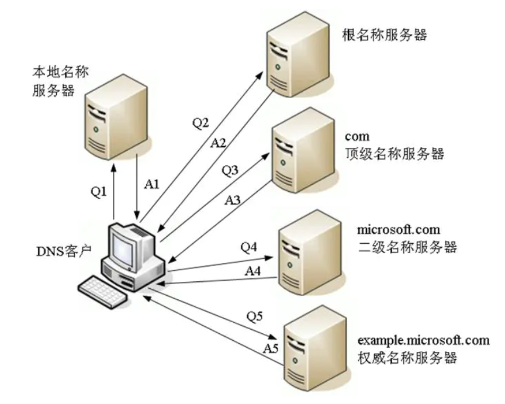

> 图源：https://www.jianshu.com/p/183ef16854f1

2. 2 本地DNS服务器通过DNS解析，找到负载均衡DNS所在的地址。负载均衡DNS对CDN服务器根据用户地址和CDN服务器状态，选择最适宜用户的服务器，返回给本地DNS服务器。本地DNS服务器将获得的CDN服务器地址告知客户端，这样客户端直接与对应CDN服务器进行交互。

   对于原始资源记录的修改，只需要将域名解析的权限交给CDN运营商，这样解析的结果就是负载均衡DNS。

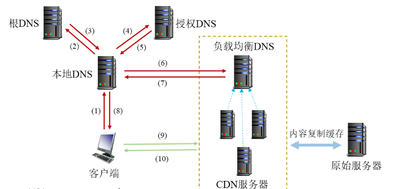

2. 3 DNS基于UDP，仍保持可靠性的原因：

UDP“不可靠”只是意味着协议本身不指定任何正式机制用于确认、重传、重新排序、纠错等，因此UDP轻量且快速。DNS客户端和服务器通过使用UDP作为基础的高阶应用程序级协议，来实现数据包丢失、纠错等应对机制，而不是被迫使用协议中指定的机制本身。

另外，对于DNS服务而言，使用的UDP数据包小，当小于512字节时，收到即确认，且UDP协议的校验和易于验证。UDP请求-响应都是通过单个数据包完成，不需要拥塞控制、重排等，若出现丢包、出错，则上层应用进行重传。

UDP 也不总是使用UDP，当数据包大小超过512字节、或用于区域传输任务、或需要一次发送多个请求时，往往通过TCP协议进行传输。