## 实验2：配置Web服务器，编写简单页面，分析交互过程

郭坤昌 2012522

### 要求

1. 搭建Web服务器（自由选择系统），并制作简单的Web页面，包含简单文本信息（至少包含专业、学号、姓名）和自己的LOGO。
2. 通过浏览器获取自己编写的Web页面，使用Wireshark捕获浏览器与Web服务器的交互过程，并进行简单的分析说明。
3. 提交实验报告、HTML文档、捕获文件。

### 本地服务器搭建和Web页面制作

#### 使用PHPnow1.5.6配置Web开发环境

PHPnow搭建开发环境十分简单，安装即可。PHPnow集成了如下开发配置。

- Apache 2.0/2.1服务器
- PHP 5.2.14
- Mysql 5.0/5.1（由于之前配置过8.0版本，因此最终使用Mysql8.0）

搭建成功：

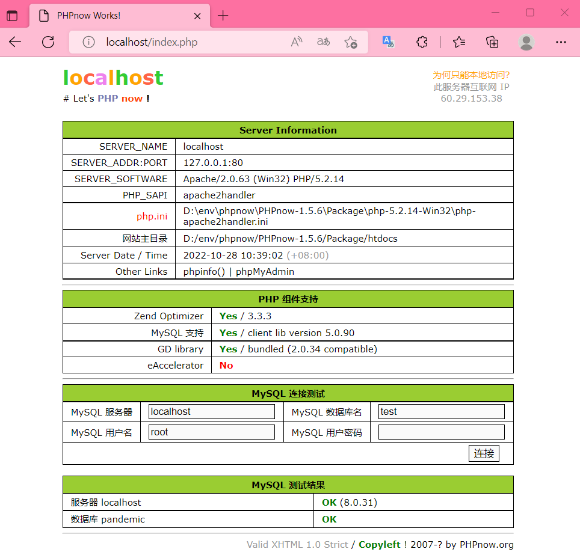

> 遇到问题：
>
> - 本地原有Mysql 和 PHPnow冲突问题：
>
>   安装时选择不同端口，实际上Apache服务器仍然连接的是3306端口的原有Mysql
>
> - Mysql8.0的登录问题
>
>   通过Apache连接Mysql8.0报错：`1251 - Client does not support authentication protocol requested by server; consider upgrading MySQL client.`，在[简书](https://www.jianshu.com/p/b338a2ffec0d)上的提示：修改登录密码的模式为`mysql_native_password`，清空权限即可。

#### Web页面编写

编写如下所示简单web页面。布局为双栏，左侧上部为普通文本，下部为表单；右侧上部为基本信息，包含专业、学号、姓名，下部为502 error的logo。在本机环境下使用访问：[Lab2Test](http://localhost:80/web/Lab2/test.html)

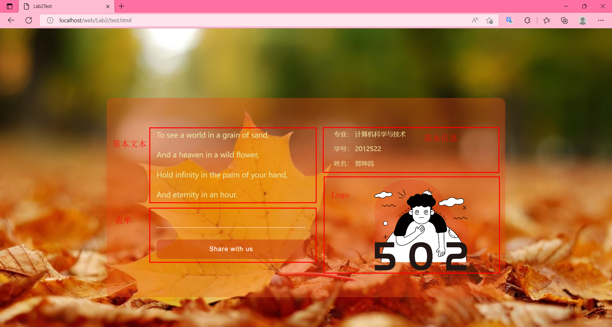

#### 浏览器与服务器交互过程

Web服务采用客户端-服务器工作模式，以超文本标记语言HTML与超文本传输协议HTTP为基础，为用户提供界面一致的信息浏览模式[^1]。Web浏览器作为客户端，负责接收请求，通过HTTP发送到服务器，将服务器回传的信息进行解释和显示。以下主要分析基于HTTP和TCP的信息交互过程。

[^1]: 《计算机网络技术与应用》张建忠，徐敬东，清华大学出版社，第13章P287

由于HTTP下层使用TCP，浏览器与本地服务器进行交互不通过网卡，服务器使用端口80，因此在WireShark中监听本地回环传输适配器（Adapter for lookback traffic capture），并设置过滤规则为`tcp.port == 80`。

##### 1. 浏览器与服务器建立连接

TCP建立连接为三次“握手”过程。

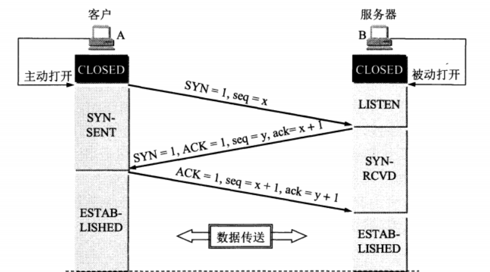

TCP协议的数据包首部格式为：

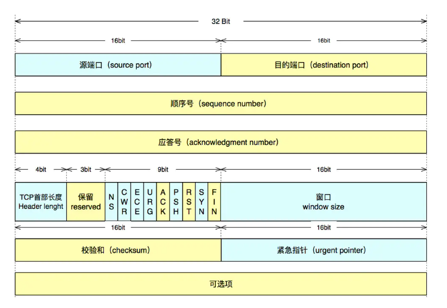

使用WireShark捕获到如下报文（部分）进行具体分析：

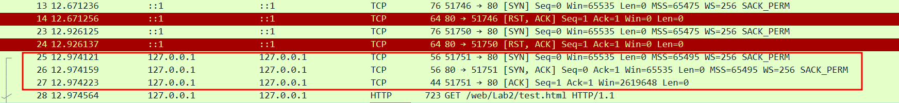

对于第一次“握手”的25号数据包，有如下详细信息：

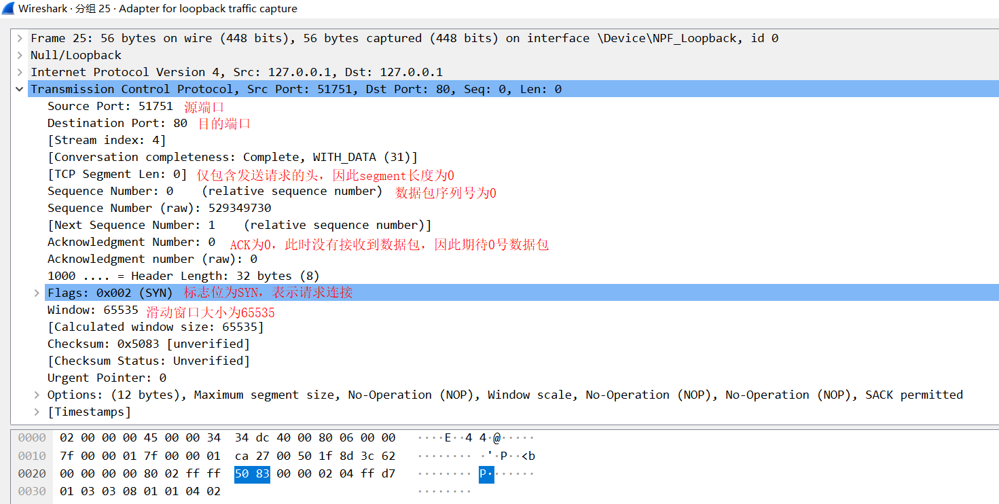

- 源端口为51751，目的端口为80，表示从浏览器向服务器发送
- 标志位为SYN，代表请求连接
- 数据包序列号为0
- ACK为0，此时未接收到数据包，期待0号数据包
- Window为65535，表示滑动窗大小。

对于第二次握手的26号数据包，有如下详细信息：

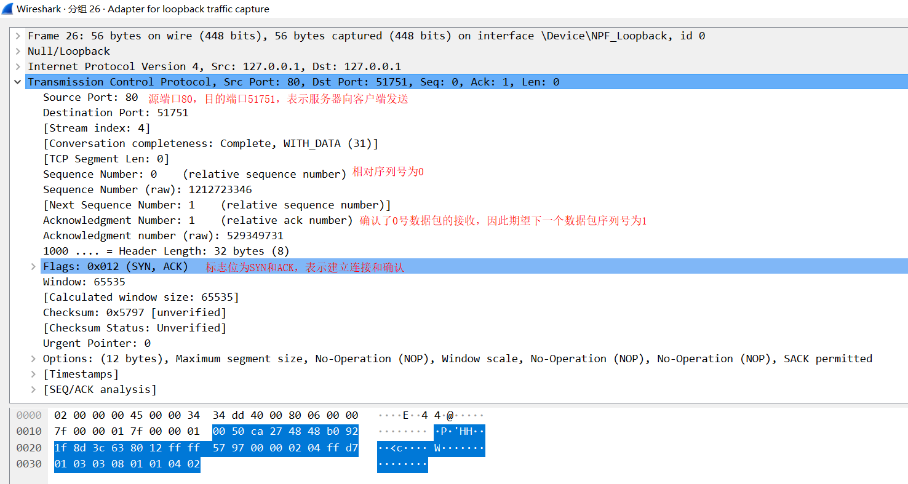

- 源端口为80，目的端口为51751，表示从服务器向浏览器发送
- 标志位为SYN和ACK，代表请求连接，并确认了上一个数据包的接收
- 相对序列号为0
- ACK为1，表示已经确认了上一个0号数据包的接收，期望下一个数据包序列号为1
- Window为65535，表示滑动窗大小。

对于第三次握手的27号数据包，有如下详细信息：

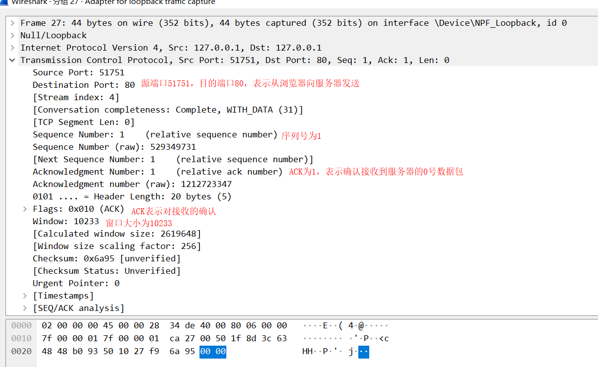

- 源端口为51751，目的端口为80，表示从浏览器向服务器发送
- 标志位为ACK，代表确认了上一个数据包的接收
- 相对序列号为1
- ACK为1，表示已经确认了上一个从服务器发送的0号数据包
- Window为10233，表示滑动窗大小。

至此，TCP连接建立成功。

##### 2. 客户端与服务器通过请求-响应模式交互

HTTP请求报文包括一个请求行和若干个报头行，有时可能有报文体。报文头和报文体之间以空行分割。

- 请求行：包括请求方法、被请求的文档、HTTP版本。主要请求方法包括GET、POST、HEAD、PUT等
- 报头行：由一行或多行组成，表示向服务器传递的附加信息。
- 报文体：有的请求报文含有报文体，有的没有。如GET方法请求时通常没有报文体，而在使用POST方法提交表单时，表单信息包含在报文体中

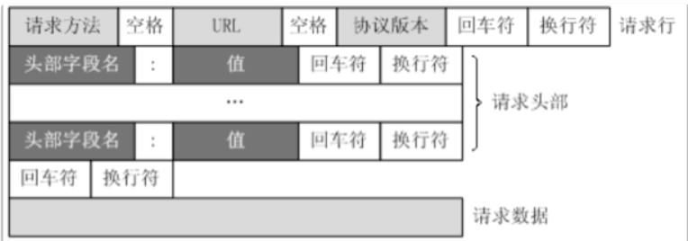

HTTP响应报文包括一个状态行和若干个报头行，有时可能有报文体。

- 状态行：包括HTTP版本、状态码、状态短语。
- 包头行：每一行由一个名字、一个冒号加空格和一个值组成。
- 报文体：响应报文的报文体中通常包含文档数据，该文档通常是客户端请求的文档。

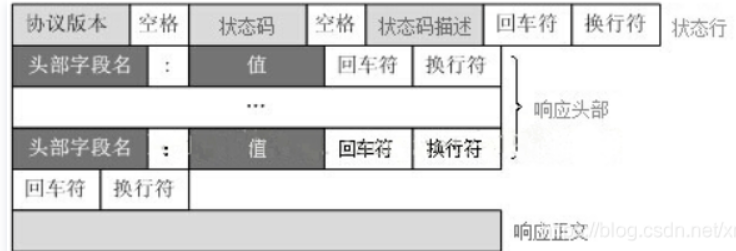

以下以捕获到的请求-应答报文进行具体分析：

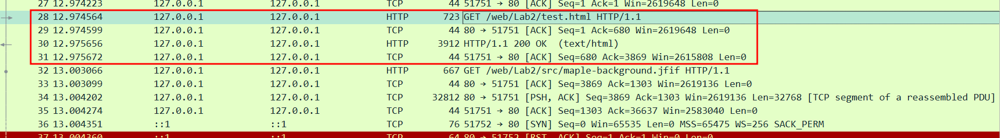

对于向服务器发送请求的第28号数据包，有如下详细信息：

- TCP部分

  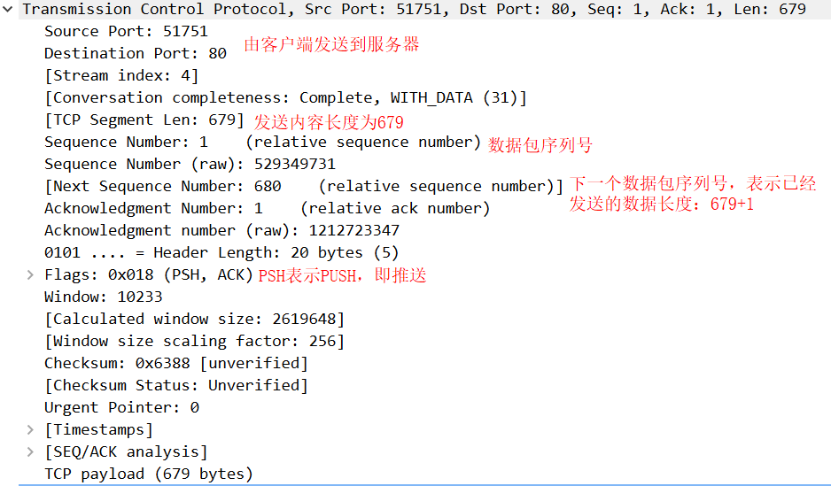

- HTTP部分

  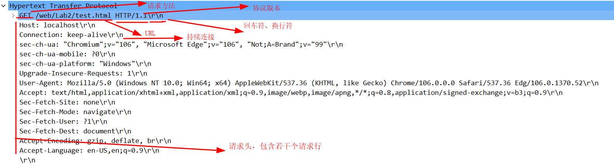

  正如HTTP协议规定的格式中所具有的属性：

  - 请求方法为GET
  - URL为 `/web/Lab2/test.html`
  - 协议版本为HTTP1.1
  - 请求头由若干个请求行隔开，其中Connection对应的值keep-alive表示持续连接
  - 最终请求头以回车符和换行符结束，由于请求方式为GET，因此没有报文体

对于29号数据包，为服务器回应浏览器已经接收到了请求数据包。

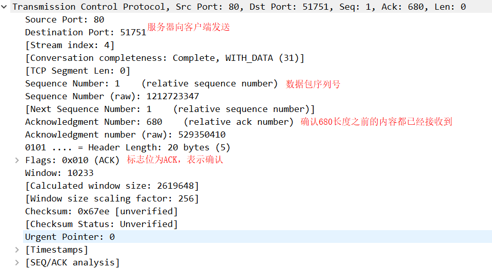

对于30号数据包，为服务器都浏览器HTTP请求的应答，详细信息如下：

- TCP部分

  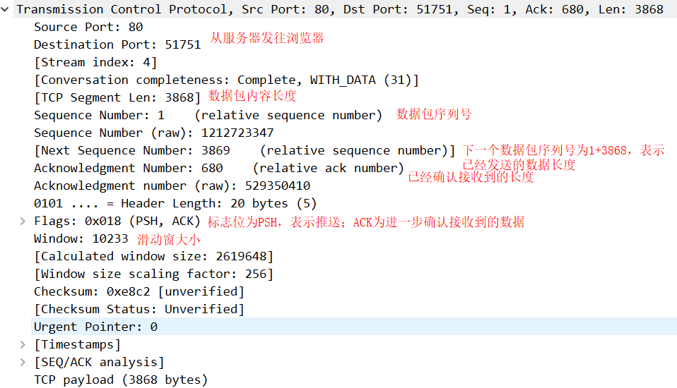

- HTTP部分

  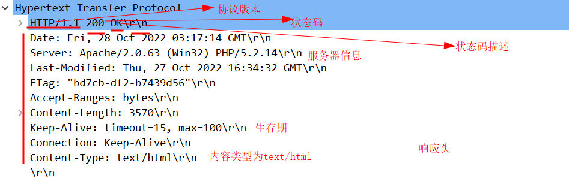

  - 协议版本为HTTP 1.1
  - 状态码为200
  - 状态码描述为OK
  - 响应头为若干个响应行组成，响应的内容类型为text/html，内容长度为3570字节

对于31号数据包，为对服务器应答的确认：

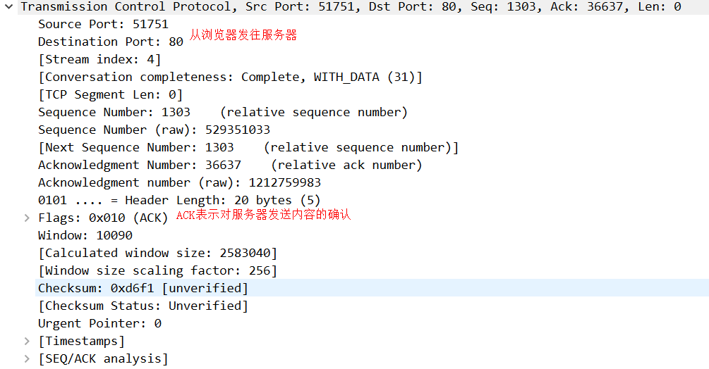

这样，就完成了一次请求-响应。由于之前已经建立起了TCP连接，且是持续连接，因此接下来在该连接的基础上，继续完成对其他资源的请求-响应。服务器通过多次发送，将资源传输给浏览器：

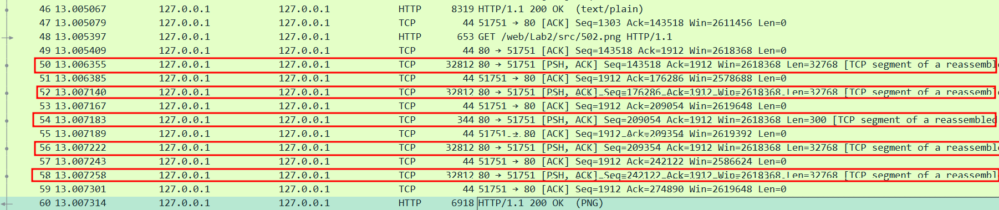

总共通过三次请求-响应，获取到了所需资源。

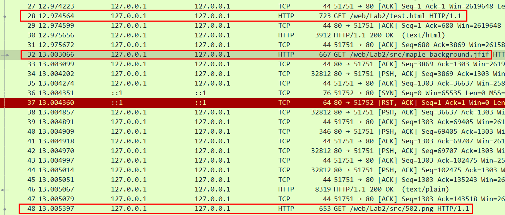

其中，在网页的反馈输入表单中，输入OK后，捕获到如下的POST请求：

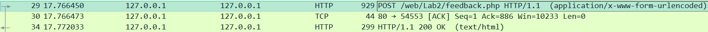

29号报文的说详细信息如下：

- HTTP请求：

  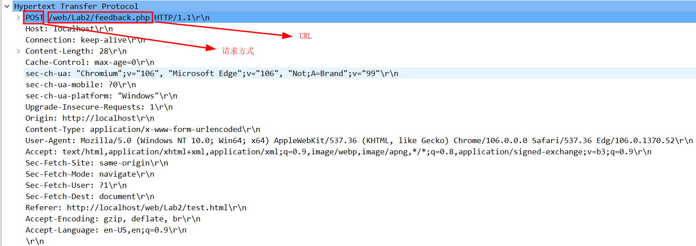

- 表单内容被编码：

  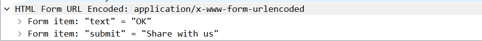

在34号响应报文的相信信息如下，注意到html文档中已经包含了要显示的内容。

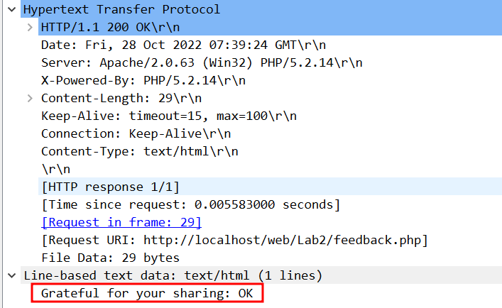

##### 3. 客户端与服务器断开连接

浏览器与服务器断开连接的过程为“四次挥手”，过程如下：

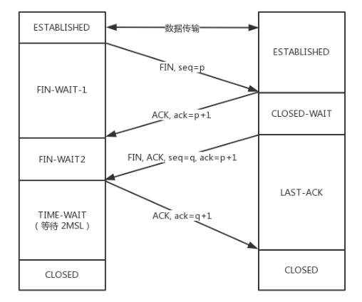

关闭页面，捕捉到数据包如下：

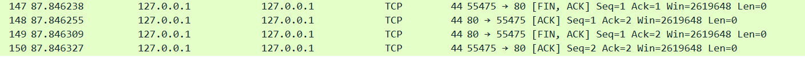

- 首先由客户端向服务器发送FIN和ACK，进入FIN-WAIT1状态，数据包ACK为1，SEQ为1
- 服务器接收到后，向客户端发送ACK，进入CLOSED-WAIT状态，数据包ACK为2，SEQ为1；客户端接收后进入FIN-WAIT2状态
- 服务器再向客户端发送FIN和ACK，进入LAST-ACK状态，数据包ACK为2，SEQ为1
- 客户端接收到后，向服务器发送ACK，进入TIME-WAIT状态，数据包ACK为2，SEQ为2

四次挥手是因为TCP是全双工的，发送FIN之后，仍可能需要接收并处理信息，此时只能接收不能发送数据报文。

这里TIME-WAIT的设定是为了丢弃之前发送的数据包且确保接收到最后一个ACK包，使得新建立的连接不会因接收到之前被延迟的数据包而产生歧义。选择2MSL可以理解为数据包一个来回所需的最长时间。

##### 4. 其他内容补充

- 响应报文中出现`HTTP 304 NOT MODIFIED`，这是因为客户端向服务器请求时，包含了两个条件请求，`If-Modified-Since` 和 `If-None-Match`，服务器通过客户端传递的值判断缓存的资源是否最新，如果是则告知客户端。

- 传输过程结束后的持久性保持：

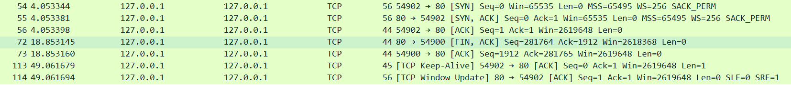

结合TCP有限状态机，在数据传输阶段结束后，浏览器和服务器进行了“三次握手”，重新建连，此时没有资源请求，服务器向客户端发送FIN和ACK，因此客户端进入了FIN_WAIT_1状态，同时发送ACK，进入CLOSING同时关闭状态；服务器收到ACK，进入TIME_WAIT状态。

一段时间后出现第113报文，为保持连接所用，由客户端向服务器发送仍“活着”的信息，这应当是持久连接的特性；服务器也向客户端传递刷新屏幕的数据包。

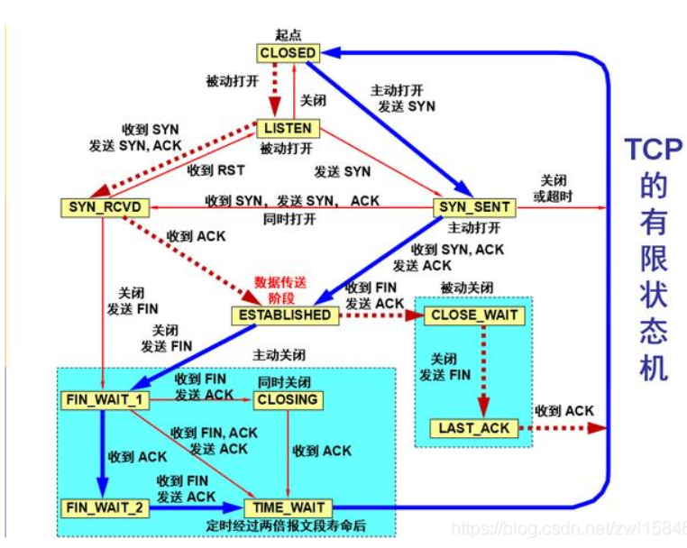