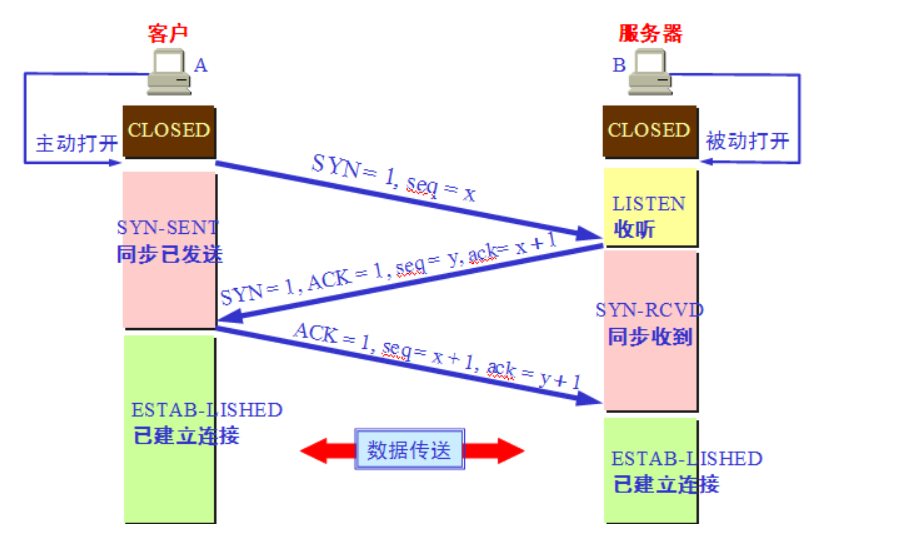
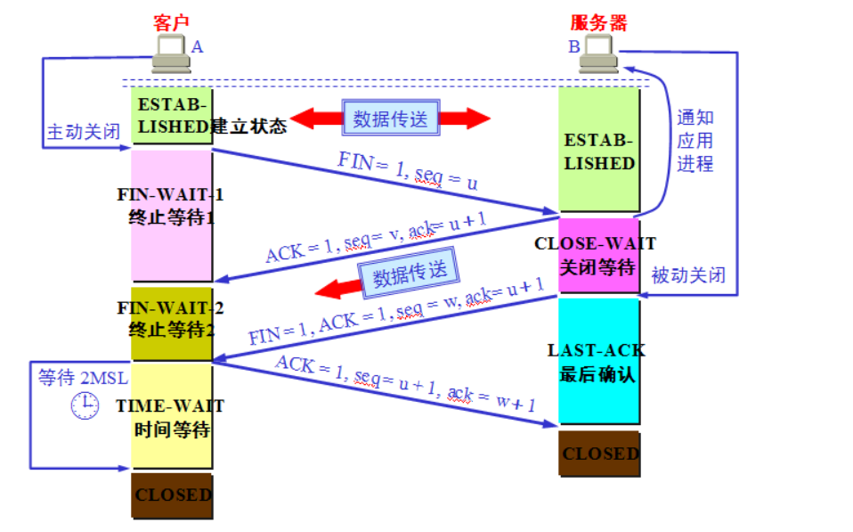

# 实验3-1 可靠数据传输编程

郭坤昌 2012522

## 要求

利用数据报套接字在用户空间实现面向连接的可靠数据传输，功能包括：建立连接、差错检测、确认重传等。流量控制采用停等机制，完成给定测试文件的传输。

## 执行流程

本实验是建立在UDP套接字上的单向可靠数据传输实现。


## 协议设计

### 面向连接——握手&挥手

#### 连接的建立



#### 连接的断开



### 差错检测——校验和

### 确认重传——rdt3.0

发送方状态图


接收方状态图


### 流量控制——停等机制

## 问题记录

1. Windows下设置`recvfrom()`为阻塞-超时模式失效

- 问题现象：

`recvfrom()`函数为阻塞函数，想要通过如下设置，使其在超时时间内，若没有接收到数据，则返回退出。然而这使其直接返回，成了非阻塞函数。

```c++
struct timeval timeout;
timeout.tv_sec = 5;
timeout.tv_usec = 0;
if(setsockopt(server_socket, SOL_SOCKET, SO_RCVTIMEO, (char *)&timeout, sizeof(timeout)) == SOCKET_ERROR) {
    exit(EXIT_FAILURE);
}
```

- 问题原因：

Window下的时间通过`DWORD`表示的毫秒来传递，Linux下使用`timeval`结构体传递。这里实际上没有正确设置超时间隔。

> 参考链接：[c - Set timeout for winsock recvfrom - Stack Overflow](https://stackoverflow.com/questions/1824465/set-timeout-for-winsock-recvfrom)

- 问题解决：

以如下方式进行设置，`recvfrom`的阻塞-超时设置成功。但实际实验中，考虑到如果出现发送方传来的包一直出现比特错误导致校验失败的话，每次都会重新启动计时器，这样就会一直阻塞在接收处，超时重传将永远不会到来。实际编程中增加了对发送包时绝对时间的记录，最多经过两个超时间隔（第一个在超时间隔之前到来，但出错，超时时间未到，等待下一个包……最后一个包到来时，如果时间已经超过超时间隔，则请求重传）

```c++
DWORD time_out;
time_out = 5 * 1000;
if(setsockopt(server_socket, SOL_SOCKET, SO_RCVTIMEO, (char *)&time_out, sizeof(time_out)) == SOCKET_ERROR) {
	exit(EXIT_FAILURE);
}
```

这样的方法，好处是编程简单，可靠；坏处是超时时间会在一个到两个超时间隔内波动。之后考虑使用线程机制模拟中断（信号量）或直接调用中断（似乎可能因编译器，不一定成功，且可能需要编写硬件）

## 程序演示