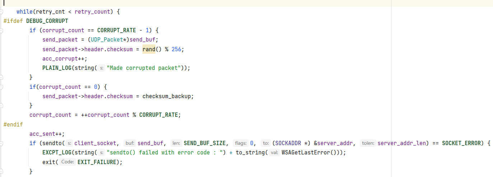

# 实验3-1 可靠数据传输编程

郭坤昌 2012522

## 要求

利用数据报套接字在用户空间实现面向连接的可靠数据传输，功能包括：建立连接、差错检测、确认重传等。流量控制采用停等机制，完成给定测试文件的传输。

## 执行流程

本实验是建立在UDP套接字上的单向可靠数据传输实现（客户端向服务器发送数据）。

开始时由客户端选择传输文件，建立连接时与服务器约定最大数据段大小（MSS，maximum segment size），并发送文件相关参数（文件名、文件大小）；建连后以校验确认、超时重传、停等协议保障客户端向服务器的单向可靠数据传输；文件发送完毕后客户端主动提起断开连接，与服务器相互“挥手”后各自释放资源。

程序在执行时，打印相关日志：时间、日志类型、具体动作或数据包内容或状态等。

## 协议设计

### 数据包格式设计

数据应包含传输的数据以及对数据的相关说明（数据包首部），设计如下：

```c++
#pragma pack(1) // align to 1 byte
struct UDP_Header {
    u32 seq_num;                // 4B, sequence number
    u32 ack_num;                // 4B, acknowledgement number
    u16 length;                 // 2B, length of data segment
    u16 checksum;               // 2B, checksum of the packet
    u8 flags;                   // 1B, flags of the packet, one hot encoded, 0x01 for SYN, 0x02 for ACK, 0x04 for FIN, 0x08 for RST
    u8 filter;                  // 1B, filler to make the header align to 16 bits
};
struct UDP_Packet{
    UDP_Header header;
    u8 data[DATA_MAX_SIZE];   // data of the packet
};
struct File_Info {  // this struct is used to send file info to the server
    u16 MSS;                    // maximum segment size
    u32 file_size;
    u16 file_name_len;
    u8 file_name[FILE_NAME_MAX_SIZE];
};
#pragma pack()  // align to default
```

首部包含了序列号、确认号、数据字段长度、校验和以及数据包类型标识。需要注意的是，这里是模拟的UDP数据包，低层通过IP协议传输，其指示数据长度的字段有16位，因此这里能够传输的数据字段长度不应当大于$2^{16}-HEADER\_SIZE$

另外设计了用以“握手”的数据格式`File_Info`，包含`MSS`、文件大小、文件名长度（硬性约定其大小不超过256）和文件名，这样客户端将该数据传递给服务器解析，并由服务器确认，完成连接时的相互约定。

### 面向连接——握手&挥手

#### 连接的建立

连接的建立完全参照了TCP协议建立连接的“三册握手”过程：

1. 客户端主动打开，发送SYN，其中包含约定内容（如前所述的`File_Info`数据）

2. 服务器解析SYN数据包，确定`MSS`、文件名、文件大小，向客户端发送确认

   > MSS在这里被设定为客户端发送缓冲区大小和服务器接收缓冲区大小的最小值，保证数据能够被完整发送和接收

3. 客户端收到确认，向服务器确认收到约定，并在该数据包中负载数据，之后继续传输后续内容

这里如何==设定序列号和确认号，并进行确认==的方式，在后续==差错确认、超时重传==部分进行详细介绍。


#### 连接的断开

连接断开的过程类似TCP协议，但不为四次挥手，而为三次挥手的过程：

1. 客户端接收到服务器最后一个确认后，文件发送完毕，主动发送FIN类型数据包，等待服务器确认
2. 服务器接收到客户端断开请求，对此进行确认，发送一个FIN_ACK类型数据包，等待客户端确认
3. 客户端接收到服务器确认，只发送一个确认数据包，之后断开连接；服务器确认后断开连接


### 差错检测和确认——校验和&确认号依确认数据量递增

差错检测使用16位校验和方式。为数据打包时，将所有数据以16位的方式相加、回卷，保存到校验和字段。因此在校验时，只需要将所有数据（包括校验和字段）以16位方式相加、回卷，只需检验最终计算结果是否为全1即可。

 $checksum + (-checksum) = 0xffff$

相关代码：

```c++
bool PacketManager::is_corrupted(UDP_Packet *packet) {
    u32 checksum = 0;
    u16* ptr = (u16*) packet;
    u16 total_length = TOTAL_LEN(packet);
    while(total_length > 1) {
        checksum += *ptr++;
        total_length -= 2;
    }
    if(total_length > 0) {   // if the length is odd, add the last byte
        checksum += *(u8*)ptr;
    }
    checksum = (checksum >> 16) + (checksum & 0xffff);  // add high 16 to low 16
    checksum += (checksum >> 16);
    return (u16)(checksum) != 0xffff;
}
```

### 确认重传——超时重传直到上限

确认重传类似rdt3.0，即不对出错接收进行相应，等待发送方超时重传解决出错问题；在序列号和确认号设置上类似TCP协议，即采用“流式”不间断地确认发送和接收的数据量。

数据的传输过程，理解为一次完整的收发和随后的数据包解析过程，通过对收发过程进行超时重传直到上限的控制，实现发送方向接收方的可靠数据传输。

在该部分表述中按如下约定：

1. 以`self.seq_num`和`self.ack_num`分别表示服务器或客户端自身的序列号和确认号
2. 以`recv.seq_num`和`recv.ack_num`表示接收数据包中的序列号和确认号字段
3. 以`send_data_size`和`recv_data_size`分别表示发送和接收的数据大小

该部分主要代码如下：

```c++
bool stop_and_wait_send_and_recv(unsigned char *data, unsigned short data_len, PacketManager::PacketType packet_type) {
    seq += data_len;    // auto increment seq
    ...//copy data to send buf

    while(retry_cnt < retry_count) {
        if (sendto(client_socket, send_buf, SEND_BUF_SIZE, 0, (SOCKADDR *) &server_addr, server_addr_len) == SOCKET_ERROR) {
            ...//handling exception
        }

        if(retry_cnt == 0){
            start = TIME_NOW;    // start timer
        }

        memset(recv_buf, 0, MSS);
        while(true)
        {
            if (recvfrom(client_socket, recv_buf, MSS, 0, (SOCKADDR *) &server_addr, &server_addr_len) == SOCKET_ERROR) {
                if (TIME_OUT(start)) {   // timeout
                    retry_cnt++;
                    break;	// try for another send
                }
                else {	
                    ...// handling other exceptions
                }
            }

            recv_packet = (UDP_Packet *) recv_buf;
            if (CORRUPTED(recv_packet)) {	// if corrupted, no answer
                if(!TIME_OUT(start)) continue;
                continue;
            }
            if (!ACK(recv_packet)) {	// if not ack or ack-mismatch, no answer either
                if (!TIME_OUT(start)) continue;
                continue;
            }
            if(ACK_NUM(recv_packet) != seq) {
                if (!TIME_OUT(start)) continue;
                continue;
            }
            
            ack = SEQ_NUM(recv_packet) + DATA_LEN(recv_packet);    // auto increment ack
            
            return true;    // success
        }
    }
    return false;   // retry_count times used up
}
```

#### 序列号和确认号的设置

发送数据包后，`self.seq_num += send_data_size`，对应如上代码第2行

接收数据包后，`self.ack_num = recv.seq_num + recv_data_size`，对应如上代码第44行

这样，`self.seq_num`记录了累计发送数据的长度，`self.ack_num`记录了累计接收的数据长度

#### 确认规则

检测`self.seq_num == recv.ack_num`，即“我方发送的总长度”是否等于“对方接收的总长度”，对应如上代码第36行

#### 出错动作——不作回应

接收到出错的数据包时，若此时没有超时，则不作任何回应。等待发送方超时重传，解决出错问题。对应第28-39行

#### 超时动作——重传数据

当超时后，若重传次数未到上限，则退出接收循环，重新发送数据。对应如上代码第18-20行

如何判定超时呢？首先设定超时时限，将套接字接收设置为==阻塞-超时==模式

> `sendto`函数为非阻塞函数，将接收缓冲区交给下层IP协议进行发送；
>
> `recvfrom`函数默认为阻塞函数，通过如下设置，将使其阻塞特定时长，若超时则退出。

```c++
void Client::set_timeout(int sec, int usec) {
    time_out = sec * 1000 + usec / 1000;
    if(setsockopt(client_socket, SOL_SOCKET, SO_RCVTIMEO, (char*)&time_out, sizeof(time_out)) == SOCKET_ERROR){
        ...// handling exception
    }
}
```

#### 重传至限——报错退出

当重传达到上限，则认为接收端无法接收到，此时报错退出。对应如上代码第46行

### 状态转换

状态转换基于当前状态和对接收到数据包的解析结果。

#### 服务器

服务器主要状态和动作如下：

1. LISTEN：

监听来自客户端的SYN连接请求，获取其中的约束信息（MSS大小、文件名和大小），同时转换到SYN_RCVD状态。

2. SYN_RCVD：

完成一次完整的数据传输过程：向客户端发送SYN_ACK数据包，对MSS大小进行最后确认；等待来自客户端的ACK（该数据包可同时负载文件数据，具有PSH属性）。若得到确认，则进入连接建立ESTABLISHED状态。

3. ESTABLISHED：

接收来自客户端的ACK_PSH数据包，并进行确认。由于是停等协议，因此每一次接收都可以交付，即将数据写入文件末端。文件下载完毕，若接收到客户端的FIN，则进入LAST_ACK状态，准备关闭连接，释放资源。

4. LAST_ACK：

完成一次完整的数据传输，向客户端发送ACK_FIN，确认其关闭请求，当收到客户端ACK后，释放资源，最终状态为CLOSED。

有限状态机转换精简代码如下：

```c++
void Server::start() {
    while(true) {
        switch (state) {
            /*
             *  Listen state:
             *  Action: Wait for SYN packet from client -> Change state to SYN_RCVD
             *  Note: The ultimate MSS(max_segment_size) is the minimum of server's recv buffer size and client's max send buffer size
             */
            case LISTEN: {
                if (recvfrom(server_socket, recv_buf, RECV_BUF_SIZE, 0, (SOCKADDR *) &client_addr, &client_addr_len) == SOCKET_ERROR) {
                    ...// handle exception
                }
                recv_packet = (UDP_Packet *) recv_buf;
                if (CORRUPTED(recv_packet)) {
                    ...// handle exception
                        break;
                }
                if(!SYN(recv_packet)) {
                    ...// handle exception
                    break;
                }
                parse_recv_packet();
                state = SYN_RCVD;
                break;
            }
            /*
             *  SYN_RCVD state:
             *  Action: Send MSS to client -> Wait for ACK packet from client -> Change state to ESTABLISHED
             */
            case SYN_RCVD: {
                set_timeout(2, 0);  // set timeout to 2 sec
                set_retry_count(5);
                start = TIME_NOW;
                PLAIN_LOG(string("Global timer started"));

                if(!stop_and_wait_send_and_recv((unsigned char *) &MSS, sizeof(MSS), PacketManager::SYN_ACK)) {
                    ...// handle exception
                }
                parse_recv_packet();

                state = ESTABLISHED;
                STATE_LOG(string("Server state: ESTABLISHED"));
                break;
            }

            /*
             *  ESTABLISHED state:
             *  Action: Return and start transaction
             */
            case ESTABLISHED: {
                while(acc_recv_size <= recv_file_size && state != LAST_ACK) {
                    if(!stop_and_wait_send_and_recv((u8*)&null_data, 1, PacketManager::ACK)) {
                        ...// handle exception
                    }
                    parse_recv_packet();
                }
                state = LAST_ACK;
                break;
            }
            /*
             *  LAST_ACK state:
             *  Action: Send FIN packet to client -> Wait for ACK packet from client -> Change state to CLOSED
             */
            case LAST_ACK: {
                if(!stop_and_wait_send_and_recv((u8*)&null_data, 1, FIN_ACK_TYPE)) {
                    ...// handle exception
                }
                state = CLOSED;
                return;
            }
        }
    }
}
```

#### 客户端

客户端主要状态和动作为：

1. CLOSED：

主动提起连接请求，选定传输文件后，将自身最大发送缓冲区大小、文件信息发送给服务器，作为连接约定。之后进入SYN_SENT状态。

2. SYN_SENT：

接收服务器的SYN_ACK数据包，确认MSS大小，向服务器发送负载有数据的ACK数据包，进入连接建立状态。

3. ESTABLISHED：

持续完成数据传输。只有接收到服务器确认，才进行下一轮数据传输。文件传输完毕，接收到服务器确认后，进入FIN_WAIT_1状态，准备释放资源。

4. FIN_WAIT_1：

向服务器发送FIN数据包，接收到服务器确认后，进入FIN_WAIT_2状态。

5. FIN_WAIT_2:

向服务器发送断开确认，进入CLOSED状态。

有限状态机转换精简代码如下：

```c++
void Client::start() {
    if(!choose_send_file(res_dir)){
        ...// handle exception
    }
    
    while(true){
        switch(state) {
            /*
             * Closed state:
             * Action: Send SYN packet to server and wait for ack -> change state to SYN_SENT
             */
            case(CLOSED):{
                File_Info* file_info = PacketManager::make_file_info(MSS, send_file_size, send_file_name);
                if(!stop_and_wait_send_and_recv((u8*)file_info, FILE_INFO_LEN(file_info), SYN_TYPE)){
                   ...// handle exception
                }
                parse_recv_packet();	// parse syn_ack packet
                state = SYN_SENT;
                break;
            }
            /*
             * SYN_SENT state:
             * Action: send ACK packet to server and wait for ack -> change state to ESTABLISHED
             */
            case(SYN_SENT):{
                read_data_len = READ_DATA(&send_file, data_buf, MSS-HEADER_SIZE);
                if(!stop_and_wait_send_and_recv((unsigned char*)data_buf, read_data_len, PSH_ACK_TYPE)){
                    ...// handle exception
                }
                state = ESTABLISHED;
                break;
            }
            /*
             * Established state:
             * return to continue transaction with server
             */
            case ESTABLISHED:{
                while(acc_sent_size < send_file_size){
                    read_data_len = READ_DATA(&send_file, data_buf, MSS-HEADER_SIZE);
                    if(!stop_and_wait_send_and_recv((unsigned char*)data_buf, read_data_len, PSH_ACK_TYPE)){
                        ...// handle exception
                    }
                }
                state = FIN_WAIT_1;
                break;
            }
            /*
             * FIN_WAIT_1 state:
             * Action: send FIN packet to server and wait for ack -> change state to FIN_WAIT_2
             */
            case FIN_WAIT_1:{
                if(!stop_and_wait_send_and_recv((u8*)&null_data, sizeof(null_data), FIN_ACK_TYPE)){
					...// handle exception
                }
                parse_recv_packet();	// parse FIN_ACK packet
                state = FIN_WAIT_2;
                break;
            }
            /*
             * FIN_WAIT_2 state:
             * Action: send ACK packet to server -> close
             */
            case FIN_WAIT_2:{
                send_packet = MAKE_PKT(ACK_TYPE, seq, ack, (u8*)&null_data, sizeof(null_data));
                sendto(client_socket, (char*)send_packet, TOTAL_LEN(send_packet), 0, (SOCKADDR*)&server_addr, server_addr_len);
                Sleep(1000);    // sendto is non-blocking, sleep for 1s to ensure packet is sent
                state = CLOSED;
                return;
            }
        }
    }
}
```

### 流量控制——停等机制

如确认重传部分所述，将数据的传输过程，理解为一次完整的收发和随后的数据包解析过程，之后再启动下一次的数据传输。因此同一时刻，只有服务器或客户端在发送数据包，另一方处于等待接收状态。

特别需要注意的是超时时间的设定。详见问题记录部分的超时时间设定部分。最终得到结论：==该停等协议只能保证一方的传输是可靠的，且其超时时间与重传次数的乘积，应当小于另一方的单次超时时间==。

## 问题记录

1. Windows下设置`recvfrom()`为阻塞-超时模式失效

- 问题现象：

`recvfrom()`函数为阻塞函数，想要通过如下设置，使其在超时时间内，若没有接收到数据，则返回退出。然而这使其直接返回，成了非阻塞函数。

```c++
struct timeval timeout;
timeout.tv_sec = 5;
timeout.tv_usec = 0;
if(setsockopt(server_socket, SOL_SOCKET, SO_RCVTIMEO, (char *)&timeout, sizeof(timeout)) == SOCKET_ERROR) {
    exit(EXIT_FAILURE);
}
```

- 问题原因：

Window下的时间通过`DWORD`表示的毫秒来传递，Linux下使用`timeval`结构体传递。这里实际上没有正确设置超时间隔。

> 参考链接：[c - Set timeout for winsock recvfrom - Stack Overflow](https://stackoverflow.com/questions/1824465/set-timeout-for-winsock-recvfrom)

- 问题解决：

以如下方式进行设置，`recvfrom`的阻塞-超时设置成功。但实际实验中，考虑到如果出现发送方传来的包一直出现比特错误导致校验失败的话，每次都会重新启动计时器，这样就会一直阻塞在接收处，超时重传将永远不会到来。实际编程中增加了对发送包时绝对时间的记录，最多经过两个超时间隔（第一个在超时间隔之前到来，但出错，超时时间未到，等待下一个包……最后一个包到来时，如果时间已经超过超时间隔，则请求重传）

```c++
DWORD time_out;
time_out = 5 * 1000;
if(setsockopt(server_socket, SOL_SOCKET, SO_RCVTIMEO, (char *)&time_out, sizeof(time_out)) == SOCKET_ERROR) {
	exit(EXIT_FAILURE);
}
```

这样的方法，好处是编程简单，可靠；坏处是超时时间会在一个到两个超时间隔内波动。之后考虑使用线程机制模拟中断（信号量）或直接调用中断（似乎可能因编译器，不一定成功，且可能需要编写硬件）

2. 超时重传次数和时间的设定

- 问题现象

在早期的实验过程中，设定服务器和客户端的超时时间均为1s，重传次数为3次，而一旦丢包却出现了很多接收包错误的情况，最终无法接收到完整的数据。

- 问题原因

当出现丢包后，发送方进行重传，此时另一方如果也处于超时重传状态，它们便相互发送数据。此时它们发送的数据包不会相互匹配（对方发送的数据要么领先当前一轮，或落后当前一轮），在校验时便会出现一个或多个校验和错误的情况。

因此必须保证，同一时刻只有一方在发送数据。在下一轮发送前，它必须接收到对方的数据，这也是“停等收发”函数主要解决的问题。

- 问题解决

将一次数据传输的收发视为完整过程，发送方只有接收到确认数据包后才能进行下一轮传输；或者超时重传达到上限，报错退出。因此必须保证，主要数据发送方（此实验中为客户端）的总超时时间（单次超时时间与超时次数乘积）小于主要数据接收方（此实验中为服务器）的单次超时时间，这样就能完全避免同时发送数据的情况。详细实现见协议设计的确认重传部分解决。

3. Router程序设置问题

路由程序作为服务器与客户端的中转，正确的设定是，将Router作为客户端的远程服务器，Router中的服务器设定为服务器的端口号和地址。

4. 性能测量

由于时间问题，没有对程序在不同MSS、时延、丢包率的情况下进行测量，并分析其中关系。这部分工作留作后期继续完成。

## 程序演示

### 基本日志

- 初始化


- 连接建立


- 连接断开

以客户端为例，展示


- 传输验证

设定MSS为10240，在如下的丢包率和时延下进行测试。


客户端最终日志为：


服务器最终日志为：


传输结果：

显然客户端发送数据和服务器接收到的数据相同，出错包一致，重传数大致满足丢包条件。最终文件大小与原始文件一致。


### 可靠传输验证——校验&超时重传

#### 对出错包的处理

设定出错率，达到累计的传包次数时，对包的校验和字段进行随机替换（这样确认时不会得到16位全1结果）；否则在重传时，还原数据包的校验和字段。主要代码如下：



打印得到的日志：

- 客户端（发送方）

下图为制作错包，服务器不作回应，引起客户端超时重传的日志


客户端制作错包统计


- 服务器（接收方）

下图为服务器接收到错包且不回应的日志


服务器最终统计的错包数量与客户端制作错包数量一致


#### 弱网条件丢包下的超时重传

下图为客户端在路由程序执行丢包操作后，打印的日志


## 实验环境

CLion2022 ，C++17，MinGW，Windows10