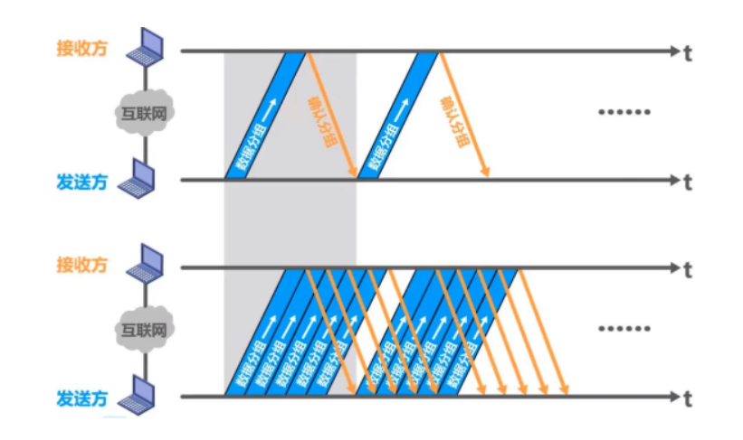
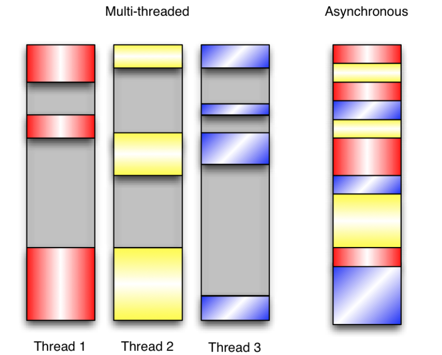
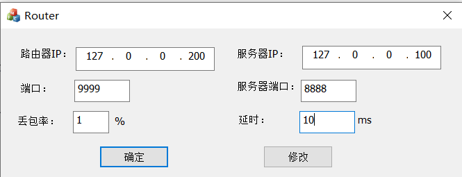
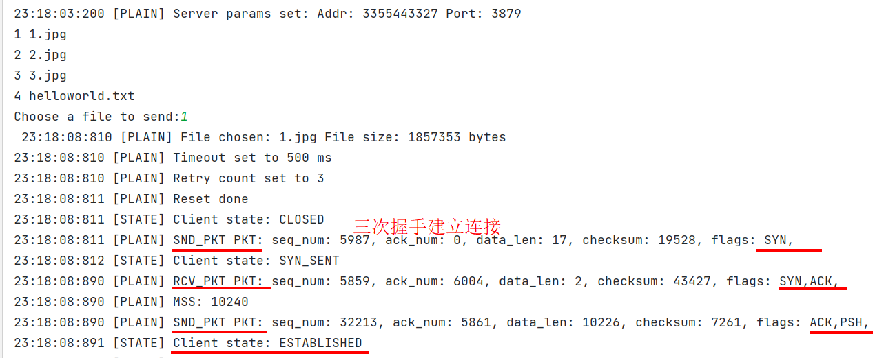
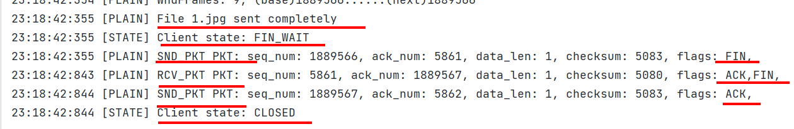
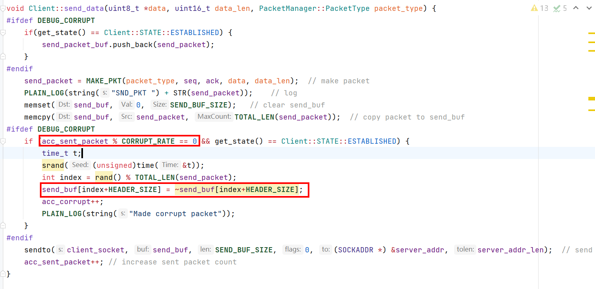
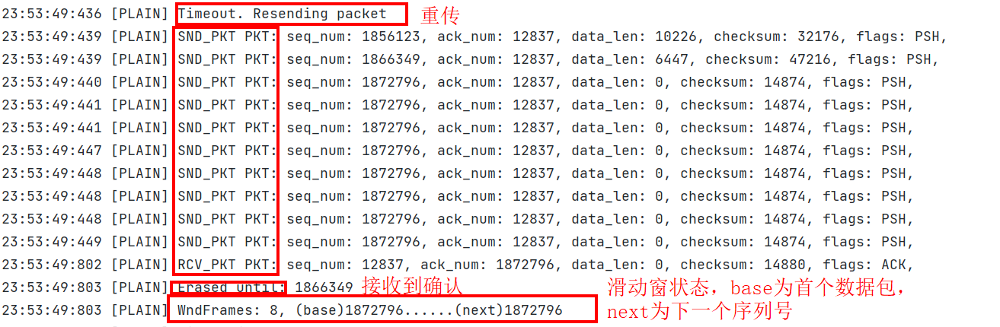
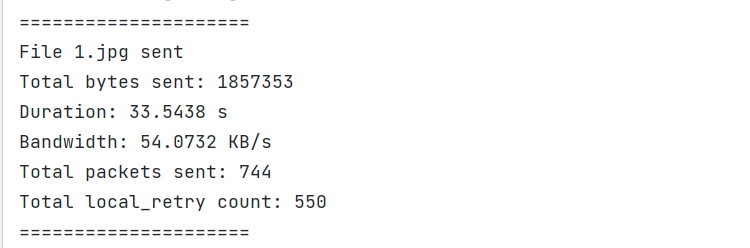
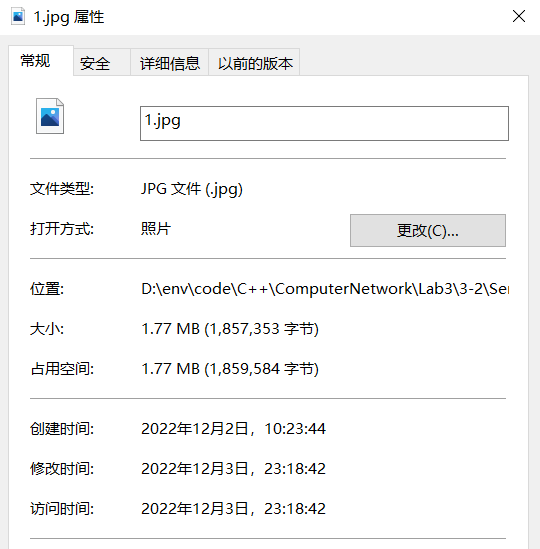

# 实验3：基于UDP服务设计可靠传输协议并编程实现（3-2）

## 要求

实验3-1的基础上，将停等机制改成基于滑动窗口的流量控制机制，采用固定窗口大小，支持累积确认，完成给定测试文件的传输

## 执行流程

本实验基于3-1实现的停等机制可靠数据传输，将其修改为Go Back N（GBN）机制。

1. 在建立连接阶段，采用TCP三次握手，将以下信息从发送方告知接收方——文件名、文件大小、发送方最大单次传输数据长度（MSS）、发送方在连接建立阶段采用GBN协议时的起始序列号，这样接收方获取相应传输信息，尤其重要地，是得知连接建立后，应当“期待”的发送方数据包序列号。
2. 连接建立后，发送方使用GBN机制，对如下事件进行响应：滑动窗不满，发送一个数据包，并将其缓充，当滑动窗为空时，启动定时器；接收到来自接收方对滑动窗中缓冲数据包的确认，连续将数据包从缓冲区中弹出，直到确认数据包被最后弹出；定时器超时，重传滑动窗中的所有的数据包。

> 将发送数据包缓冲区既作为滑动窗、又作为缓冲区来使用，因此滑动窗中的数据包均是已发送但未确认的数据包，且滑动窗的大小等于其中数据包的数量。

3. 连接的释放发生在发送方已经将所有数据发送完毕，且接收到接收方对最后一个数据包的确认（即确认数据已全部被接收方下载），主动进入FIN-WAIT状态，与发送方通过三次挥手（与TCP不同的是，接收方在接收发送方断开连接请求后，同时进行ACK和FIN回应，因此少了一次挥手，该部分在之前实验报告中有详细说明）释放连接。

## 协议设计

### Go Back N协议

当使用停等机制时，发送方必须等待确认后才传输下一个数据包，这样中间有大量时间没有得到利用。使用滑动窗机制时，可以同时发送多个未经确认的数据包，大大提高了信道利用率。



发送端设计：

1. 维护固定上限的滑动窗，将其作为队列使用，缓存有已经发送但未经确认的数据包

2. 当滑动窗未满时，从文件中读取数据，封装为数据包，发送给接收端并压入滑动窗。若滑动窗为空，则启动定时器，相当于对发送的第一个数据包进行计时。每发送一个未缓存的数据包，发送端序列号增加数据长度大小，作为下一个数据包的序列号。起始的序列号通过随机数产生

3. 当接收到确认数据包时，检查其确认号（`ACK number`）与滑动窗中数据包序列号的关系——从头遍历，直到找到数据包`packet`满足如下数量关系
   $$
   ack\_num(recv\_packet) = seq\_num(packet) + data\_len(packet)
   $$
   其中，`data_len`表示数据长度。`ack_num(recv_packet)`为接收方期待的数据包序列号，因此该关系表示该数据包已被接收方确认。由于接收方采用累计确认机制，因此该数据包及之前数据包已被确认，将已确认数据包从滑动窗中弹出。同时启动定时器，相当于对当前滑动窗中的第一个未确认数据包进行计时

   若未找到数据包满足上述关系，或数据包出错，则丢弃该数据包，同时不做任何动作

4. 计时器超时，重传滑动窗中所有数据包，该部分数据包均为已发送但未确认

```c++
// 发送方主体部分对三种事件（滑动窗未满、接收到数据包、超时）的响应机制：

void Client::main_process() {
    ...// set first state to close
    while (true) {
        switch (get_state()) {
            case CLOSED:
                ...
            case SYN_SENT:
                ...
            case ESTABLISHED:
                local_retry = 0;
                while (true) {  // file hasn't been sent completely
                    /* if receive a packet, check if ack and not-corrupted */
                    if (recvfrom(client_socket, recv_buf, RECV_BUF_SIZE, 0, (SOCKADDR *) &server_addr,
                                 &server_addr_len) > 0) {   
                        set_event(Client::EVENT::RDT_RCV);
                        if (handle_event()) {   // Parse packet received. erase acked packets. Acc sent increased here.
                            local_retry = 0;        // reset local retry times
                            local_start = TIME_NOW; // restart local timer when receiving new ack
                            if(acc_sent_size == send_file_size) { // file sent completely and got last ack from server1
                                set_state(Client::STATE::FIN_WAIT);
                                break;
                            }
                        }
                    }
                    /* send when wnd is not full and file hasn't been sent completely */
                    if (send_packet_buf.size() < WND_FRAME_SIZE && acc_sent_size != send_file_size) {
                        if(send_packet_buf.empty()) { // case that base == nextseq
                            local_start = TIME_NOW; // start local timer
                        }
                        set_event(Client::EVENT::RDT_SEND);
                        handle_event(); // send data packet
                    }
                    /* timeout, resend all packets in send buffer */
                    if(TIME_OUT(local_start)) {   // If timeout and chances are not used up, resend data packet
                        if (local_retry == retry_count) {    // else, chances used up. close and return
                            set_state(Client::STATE::CLOSED);
                            return;
                        }
                        set_event(Client::EVENT::TIMEOUT);
                        handle_event(); // resend data
                        local_start = TIME_NOW; // restart local timer
                        local_retry++;  // increase local retry times
                    }
                }
                break;
            case FIN_WAIT:
                ...
        }
    }
}
```

接收端设计：

1. 建立连接时，由发送方告知起始的数据包序列号，作为对第一个数据包的确认依据
2. 期待的序列号通过接收端自身的`ACK number`进行维护，表示已经确认的数据量
3. 累计确认机制

若接收到的数据包满足如下数量关系
$$
seq\_num(recv\_packet) = ack\_num(Server)
$$
则表示接收到的数据包为当前期待的数据包，接收并将自身`ack_number`增加`data_len(recv_packet)`，表示已经确认的数据量和期待的下一个数据包序列号

若不满足上述关系，则可能是因为丢包或失序导致，将其丢弃，同时不做任何回应。在这里设计的机制下，重传上一个确认数据包和不做回应是等价的，发送方均会将其丢弃，若要应用提前超时机制，则发送方通过对重复确认的计数可以进行提前重传以提高效率

```c++
// 接收方主体部分对接收数据包进行处理的响应机制：

void Server::main_process() {
    set_state(Server::STATE::LISTEN);   // set state to LISTEN
    while(true) {
        switch (get_state()) {
            case LISTEN:
                ...
            case SYN_RCVD:
                ...
            case ESTABLISHED:
                while(true) {
                    if (recvfrom(server_socket, recv_buf, RECV_BUF_SIZE, 0, (SOCKADDR *) &client_addr, &client_addr_len) > 0) {
                        set_event(Server::EVENT::RDT_RCV);
                        if(acc_recv_size == recv_file_size) {   // check if file received completely
                            if(handle_event()) {    // check if fin received, change state to FIN_WAIT
                                break;
                            }
                        } else {
                            if(handle_event()) {    // check if expected packet received, and download data
                                set_event(Server::EVENT::RDT_SEND);
                                handle_event(); // send ack
                                DUMP_DATA(&dump_file, DATA(recv_packet), DATA_LEN(recv_packet));
                                acc_recv_size += DATA_LEN(recv_packet);	// update expected num
                            }
                        }
                    }
                }
                set_state(Server::STATE::LAST_ACK); // change to LAST_ACK
                break;
            case LAST_ACK:
                ...
        }
    }
}
```

### 基于事件驱动的编程

本实验在3-1基础上进行了较大改动，运用了基于事件编程的思想。

以发送方为例，建立连接后需要对三种事件进行相应：滑动窗未满、接收数据包、超时。若使用多线程管理，在本实验情景下，发送方的序列号、接收方的确认号、发送方发送缓冲区、接收方接收缓冲区都将进入临界区，编程复杂性和资源开销大。因此采用基于事件的编程，轮询事件并加入处理队列进行分发，保证单个进程的有效执行。

多线程与事件驱动的时间和资源开销示意图如下：



在本实验中通过将`recv_from`函数设置为非阻塞函数，在主进程中循环检测发生的事件，并进行相应的分发。在特定状态下，对应不同事件有特定的事件处理函数，通过回调函数实现相同机制不同策略。

```c++
// 设置recvfrom为非阻塞函数
if(ioctlsocket(client_socket, FIONBIO, &on) == SOCKET_ERROR) {
    EXCPT_LOG(string("ioctlsocket() failed with error code : ") + to_string(WSAGetLastError()));
    exit(EXIT_FAILURE);
}
```

以发送方建立连接后的操作为例，在如下的循环中不断对三种事件进行检测，通过`set_event`设置时间，通过`handle_event`进行事件分发。

```c++
while (true) {  // file hasn't been sent completely
    if (recvfrom(client_socket, recv_buf, RECV_BUF_SIZE, 0, (SOCKADDR *) &server_addr,
                 &server_addr_len) > 0) {   // if receive a packet, check if ack and not-corrupted
        set_event(Client::EVENT::RDT_RCV);
        if (handle_event()) {   // Parse packet received. erase acked packets. Acc sent increased here.
            ...
            }
        }
    }
    // send when wnd is not full and file hasn't been sent completely
    if (send_packet_buf.size() < WND_FRAME_SIZE && acc_sent_size != send_file_size) {
        if(send_packet_buf.empty()) { // case that base == nextseq
            local_start = TIME_NOW; // start local timer
        }
        set_event(Client::EVENT::RDT_SEND);
        handle_event(); // send data packet
    }
    // timeout, resend all packets in send buffer
    if(TIME_OUT(local_start)) {   // If timeout and chances are not used up, resend data packet
        if (local_retry == retry_count) {    // else, chances used up. close and return
            set_state(Client::STATE::CLOSED);
            return;
        }
        set_event(Client::EVENT::TIMEOUT);
        handle_event(); // resend data
        local_start = TIME_NOW; // restart local timer
        local_retry++;  // increase local retry times
    }
}
break;
```

以发送方为例，不同状态、事件及相应处理函数的对应关系：

```c++
// 类内枚举状态
enum STATE {
    CLOSED, SYN_SENT, ESTABLISHED, FIN_WAIT
};
// 枚举事件
enum EVENT {
    RDT_SEND, RDT_RCV, TIMEOUT
};
// 类内函数指针
typedef bool (Client::*FP)();
// 事件处理表项数据类型
typedef struct {
    STATE state;
    EVENT event;
    FP fp;
} EventHandlerEntry;
STATE state;
EVENT event;
// 事件处理映射表
EventHandlerEntry event_handler_table[6][3] = {
  {{CLOSED,RDT_SEND,&Client::Closed_Send},
   {CLOSED,RDT_RCV,&Client::Null_Func},
   {CLOSED,TIMEOUT, &Client::Null_Func}},
    
  {{SYN_SENT,RDT_SEND,&Client::SynSent_Send},
   {SYN_SENT,RDT_RCV,&Client::SynSent_Rcv},
   {SYN_SENT,TIMEOUT, &Client::SynSent_Timeout}},
    
  {{ESTABLISHED, RDT_SEND, &Client::Establish_Send},
   {ESTABLISHED, RDT_RCV, &Client::Establish_Rcv}, 
   {ESTABLISHED, TIMEOUT,&Client::Establish_Timeout}},
    
  {{FIN_WAIT,RDT_SEND,&Client::FinWait_Send},
   {FIN_WAIT,RDT_RCV, &Client::FinWait_Rcv},
   {FIN_WAIT,TIMEOUT, &Client::FinWait_Timeout}},
};
STATE get_state();
```

通过`handle_event`函数实现相同机制、不同策略的事件处理

```c++ 
bool Client::handle_event() {
    return (this->*event_handler_table[state][event].fp)();
}
```

## 问题记录

### GBN中发送方base_num和接收方expected_num的设置

本实验中的关键在于如何处理发送方对发送数据包序列号的设置和接收方对自身期待序列号的设置。以下给出本实验中的可行设计

发送方：

1. 发送数据包的初始序列号通过随机数产生

2. 每发送一个数据包，下一个数据包的序列号增加上一个数据包的数据长度，因此GBN中的base_num对应于滑动窗中第一个数据包的序列号（最早未被确认的数据包序列号）

3. 当接收到确认数据包时，检查其确认号（`ACK number`）与滑动窗中数据包序列号的关系——从头遍历，直到找到数据包`packet`满足如下数量关系
   $$
      ack\_num(recv\_packet) = seq\_num(packet) + data\_len(packet)
   $$
      其中，`data_len`表示数据长度。`ack_num(recv_packet)`为接收方期待的数据包序列号，因此该关系表示该数据包已被接收方确认。由于接收方采用累计确认机制，因此该数据包及之前数据包已被确认，将已确认数据包从滑动窗中弹出。

接收方：

1. 初始期待序列号在建立连接时与发送方约定，以确认第一个数据包
2. 采用累计确认机制（详见协议设计部分），每确认一个数据包，则自身确认号增加该数据包的数据长度，表示期待下一个数据包的序列号

## 程序演示

该部分对程序流程进行演示，并对其中可能的错误情况进行模拟，验证传输的可靠性。

路由程序设置如下



### 连接建立和释放

- 连接建立

以发送方日志为例。发送方主动提起连接，通过三次握手建立连接。



- 连接释放

以发送方日志为例。发送方主动提起释放请求，通过三次挥手释放连接（详见执行流程部分）



### 发送方发送错误包

设置错误率进行模拟，当建立连接后，达到错误次数时，将正确数据包加入滑动窗，同时发送错误数据包，这样重传时不用进行错误恢复。



### 发送方发送数据包丢失



### 传输结果

在发送方的最终日志中，打印传输时长和带宽，以及累计传输/重传数据包。注意到重传数据包数量占比极大，这里受到网络中丢包的影响十分严重



经过验证，图片完整



## 实验环境

CLion2022 ，C++17，MinGW，Windows10

## 参考文献

1. [C语言回调函数详解（全网最全）](https://blog.csdn.net/qq_41854911/article/details/121058935)